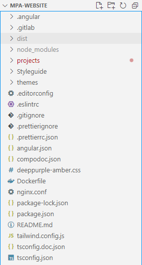
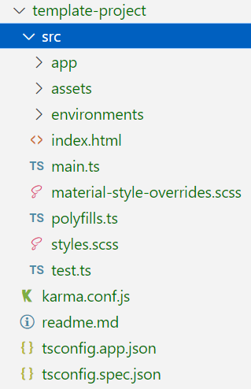
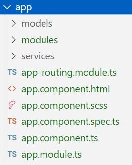
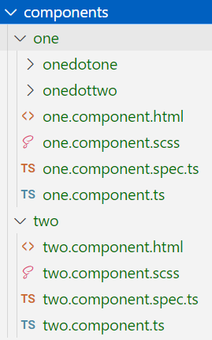

# AngularPSM

## Folder structure

### Concept

The application structure should follow the "LIFT" concept:

- locate quickly (i.e., descriptive folder structure)
- identifiability (i.e., meaningful naming)
- flat structure (i.e., no nested folders if possible)
- try to be DRY (Don't Repeat Yourself, i.e., try to reuse code)

### Implementation

An Angular workspace contains files of one or more applications. Tt contains configuration files relevant for all applications, e.g., "package.json" to specify packages and their versions.



The projects folder contains applications and libraries. The "template-project" contains an example structure for applications.



Modules are the entrypoints for Angular to build the application or parts of it ([source](https://angular.io/guide/architecture-modules)). The highest module is "app.module.ts".

The level of "app.module.ts" is also the location of the app component (the top-level component, no other components should be located at this level). Locate services and models (i.e., interfaces, enums) relevant for the complete application in the respective folders ("services", "models").

The "modules" folder contains feature submodules, i.e., isolated functional parts of the application. Modules are lazily loaded by the router on the app level.



In analogy, a submodule (i.e., located in "app/modules") follows the same structure of the app level. Every submodule needs one routing module to be laziliy-loaded. A submodule has a "module parent" component that renders all components belonging to that module. Components, services, and models relevant for that submodule are located in respective folders. Further "subsubmodules" are also possible ("modules" folder).


Components may have multiple child-components located in respective folders.



Components that are reused among multiple components should be transferred to the library project "shared-lib".

## Pretier and ESLint setup

1. In vS Code install the eslit-prettier plugin.
2. Set `"editor.formatOnSave": true` in the config

## Generate module page with routing

Example of creating an module called `metadata-quest-page` inside the `metadata-tool` project. The route quest leads to the component and is lazy loaded in the app-rounting component.

```sh
ng g m metadata-quest-page --project metadata-tool --route quest --module app-routing
```

## Run storybook

Make shure you have the the shared Library installed.

```sh
ng build shared-lib
```

**Note:** You have to `cd` inside the root folder `mpa-website` to run storybook!

```sh
ng run metadata-tool:storybook
```

## Init Repo

1. Update Node

Make sure to have npm installed on your system. Then run:

```sh
npm i
```

## Setup Backend

### Install docker container

```sh
sudo docker run -it  -d -p 9500:9500 --name metadatatool mpacloud/metadatatool-test
```

### Update Image

```sh
sudo docker pull mpacloud/metadatatool-test:latest
```

### Run docker container autmatically, when workspaces starts in VS Code

1. install the `Docker Run` extention for VS Code
2. `cmd  + shift + p` to open command palette
3. `Docker Run: Add Container`
4. Select metadatatool

Now, every time the same workspace gets opend with vs code, the docker container should start running.

## Development server

Run `ng serve` for a dev server. Navigate to `http://localhost:4200/`. The app will automatically reload if you change any of the source files.

## Code scaffolding

Run `ng generate component component-name` to generate a new component. You can also use `ng generate directive|pipe|service|class|guard|interface|enum|module`.

## Build

Run `ng build` to build the project. The build artifacts will be stored in the `dist/` directory. Use the `--prod` flag for a production build.

## Running unit tests

Run `ng test` to execute the unit tests via [Karma](https://karma-runner.github.io).

## Running end-to-end tests

Run `ng e2e` to execute the end-to-end tests via [Protractor](http://www.protractortest.org/).

## Further help

To get more help on the Angular CLI use `ng help` or go check out the [Angular CLI README](https://github.com/angular/angular-cli/blob/master/README.md).

# Styling

## CSS

TODO: best practices

## Tailwind

TODO: usage

## Overriding Angular Material Styles

If you want to style material components different from the default, please check first:

1. Can I use the API of the Angular material component (i.e., directives, property binding)?

2. Can I style the component via its selector (e.g. mat-stepper) or can I use a container (e.g. span for text, div for layout)?

THEN you need to override internal styles of the material component.

3. What is the actual internal component styling making trouble? > Use the browser devtools to inspect the html and find the corresponding classname.

4. Put the classname into the "material-styles-overrides.scss" file and test whether you can change the styling from here.

5. Find the name of the uppermost parent element of the material component and its classname (e.g., "mat-stepper-vertical" for mat-stepper).

6. Compose parent and child classnames like so:

```
.parent-class {
   & .child-class {
     // your styling here
   }
```

Check that you introduce a space between "&" and .child-class!

7. Create an individual classname for the component you want to style. Try to follow this convention:
   `.<mat-component-name>-<target-component>`
   Apply the individual classname to the material component in the html template of your component.
   Attach the individual classname to the parent classname like so:
   `.parent-class.<individual-classname> {...}`

You can also change multiple internal stylings:

```
 .parent-class.<individual-classname> {
   & .child-class1 {...}
   & .child-class2 {...}
}
```

If you are confused how this works, check out these links:

- Ampersand: https://medium.com/the-crazy-coder/what-scss-means-e448e2ac98d3
- CSS Selectors: https://www.w3schools.com/cssref/css_selectors.php
- Material overriding: https://betterprogramming.pub/best-way-to-overwrite-angular-materials-styles-e38dc8b84962

## Theming

Theming facilitates uniform coloring and typography of applications based on a defined scheme. Such a scheme, i.e. a theme, includes a palette of colors and typography styles that should be applied to all styled components.

We use Angular Material for theming which uses [SASS](https://sass-lang.com/documentation/), a stylesheet language that extends css by many features and is compiled to css.

[Angular guide to theming](https://material.angular.io/guide/theming)

### Building a Color Palette

A color palette is (usually) based on one color, e.g., green. The palette contains a list of hues for that color, e.g., dark-green, green, and light-green. Additionally, it contains contrast colors for text. The contrast colors are used if one of the greens is used as background color for that text. Thereby a high contrast between background and text is created making the text readable.

A color palette is stored as sass map and can be build using the [Material Design Palette Generator](http://mcg.mbitson.com/#!?mcgpalette0=%233f51b5).
Export the generated Palette by clicking on the download icon, select "Angular JS 2" and copy the palette into an scss file.

The palette contains hues between 50 and 900, accent hues used to emphasize elements (the "A" values, e.g., "A100"), and contrast colors for each hue (see for example mdoa-grey-palette.scss).


### Building a Theme

An Angular Material theme consists of a primary color palette, an accent color palette, and a warning color palette. The primary palette is used as a "basic" color (e.g., for navbar), the accent palette is used to emphasize specific elements (e.g., buttons), and the warn palette is used to emphasize if something is wrong (e.g., incorrect form elements).

To achieve a high color contrast you could select complementary colors for palettes, or grey/black as primary and bright colors as accent and warning. Use for example the [Adobe Color Wheel](https://color.adobe.com/de/create/color-wheel) to find complementary colors.

The theme is composed in an scss stylesheet:

```
// @use imports the Angular Material theme functions and mixins
// @use declarations need to be made before any @import or @include statements
@use '@angular/material' as mat;

// Import the custom palettes
@import './palettes/mdoa-green-palette.scss';
@import './palettes/mdoa-grey-palette.scss';
@import './palettes/mdoa-red-palette.scss';

// Define the palettes
$mdoa-primary: mat.define-palette($md-mdoagrey);
$mdoa-accent: mat.define-palette($md-mdoagreen, 500, 200, 900);
$mdoa-warn: mat.define-palette($md-mdoared);

// Define the theme
$mdoa-theme: mat.define-light-theme(
  (
    color: (
      primary: $mdoa-primary,
      accent: $mdoa-accent,
      warn: $mdoa-warn,
    ),
  )
);

```

Themes are located at the workspace level in the "themes" directory. This directory also includes all cutsom palettes under "themes/palettes".

### Project Stylesheets

Each project contains a topmost stylesheet named "styles.scss".

```
// @use has to be called before @import
// angular material theme mixins and functions
@use "@angular/material" as mat;

// custom theme mixins
@use "./dist/shared-lib/theme-mixins/footer-theme" as footer;
@use "./app/modules/test-example-content/components/theming-example/theming-example-theme"
  as example;

// angular material core styles
@include mat.core();

// custom theme
@import "../../../themes/mdoa-theme.scss";

// applies angular material typography styles
@include mat.all-component-typographies();
// applies custom theme to angular material components
@include mat.all-component-themes($mdoa-theme);
// overrides styles of angular material components
@import "./material-style-overrides.scss";

// applies custom theme to custom component
@include footer.theme($mdoa-theme);
@include example.theme($mdoa-theme);
```

The order of imports in "styles.scss" is relevant for the order in which styles are applied.

@use statements import mixins and functions and need to be included before anything else. First, angular material functions and mixins for custom themed components are imported. "@include mat.all-comonent-typographies" and "@include all-component-themes" import styles for angular material components. These are then overwritten by classes from "material-style-overrides.scss". Lastly, styles for custom themed components are imported.

These first lines should be included in every "styles.scss" file and are followed by project specific (s)css classes.

### Applying themes to custom (library) components

1. Style your component.

```
// theming-example.scss
.example-class {
  color: white;
  background-color: darkslategrey;
  padding: 1rem;
}
```

2. "color" and "background-color should be themed. Create a new file beginning with an underscore (sass naming convention), the name of the original stylesheet, and "-theme.css" at the end.

3. Create a mixin in that file. The mixin should be named "color" and takes a theme ($theme) as argument. In the mixin define the css class and corresponding properties you want to theme.

```
// _theming-example-theme.scss
@mixin color($theme) {
  .example-class {
    color: white;
    background-color: darkslategrey;
    }
}

```

4. Import functionalities from sass and angular material to read colors from palettes of the theme.

```
// _theming-example-theme.scss
@use 'sass:map';
@use '@angular/material' as mat;

@mixin color($theme) {

// Get the color config from the theme.
$color-config: mat.get-color-config($theme);

// Get the primary color palette from the color-config.
$primary-palette: map.get($color-config, 'primary');

  .example-class {
    color: white;
    background-color: darkslategrey;
    }
}

```

5. Read the desired color values from the palette using the "mat.get-color-from-palette" function. It takes the palette, a hue value, and opacity as arguments.

```
// _theming-example-theme.scss
@use 'sass:map';
@use '@angular/material' as mat;

@mixin color($theme) {

// Get the color config from the theme.
$color-config: mat.get-color-config($theme);

// Get the primary color palette from the color-config.
$primary-palette: map.get($color-config, 'primary');

  .example-class {
    color: mat.get-color-from-palette($primary-palette, default-contrast);
    background-color:  mat.get-color-from-palette($primary-palette);
    }
}
```

6. Add a theme mixin. If no theme is provided, the color mixin won't be applied. Additionally, other mixins, e.g. typography can be added at this point.

```
//_theming-example-theme.scss
@use "sass:map";
@use "@angular/material" as mat;

@mixin color($theme) {
  // Get the color config from the theme.
  $color-config: mat.get-color-config($theme);

  // Get the primary color palette from the color-config.
  $primary-palette: map.get($color-config, "primary");

  .example-class {
    color: mat.get-color-from-palette($primary-palette, default-contrast);
    background-color: mat.get-color-from-palette($primary-palette);
  }
}

@mixin theme($theme) {
  $color-config: mat.get-color-config($theme);
  @if $color-config != null {
    @include color($theme);
  }

  // add typography mixin here
}
```

(For library components:) Define one theming file per module. Locate the theming files in "theme-mixins" at the top level of the library. Stylesheets are only exported during library building when they are included in the "assets" array in ng-package.json. After building, the theme mixins are available in dist/shared-lib/theme-mixins.

7. To apply theming, theme mixins need to imported into "styles.scss" of a project using @include (see above).

# Deploying to DockerHub

`ng build --prod`
`docker build -t INSERT_NAME .`
`docker push INSER_NAME`

webstorm console:
ng build --prod

dist ordner kopieren nach "cygwin64\home\kaysc\mpa-cloud-docker"

in cygwin console:
scp -r -P 7000 -i cloud mpa-cloud-docker/ centos@129.70.51.126:/home/centos

auf BOOTSTRAP:
sudo docker build -t mpacloud/mpawebsite .
sudo docker push mpacloud/mpawebsite

container dann verfügbar auf dcos

Test-Server Access:
ssh -i cloud -L 80:129.70.51.126:10001 public

<!-- This project was generated with [Angular CLI](https://github.com/angular/angular-cli) version 6.2.3 and updated to somewhere around 7. -->

# Documentations with compodoc

## Installation

Install compodoc ([source](https://compodoc.app/guides/installation.html)).

## Code documentation

If you have a license, use GitHub copilot to accelerate writing the documentation.

Use JS docstrings:

```
/**
*  Documentaion here
*/
```

Use tags to declare parameters, return values, deprecation, or other ([source](https://compodoc.app/guides/jsdoc-tags.html)):

```
/**
* @param
* @returns
* @deprecated
*/
```

Specify parameter or return types:

```
  /**
   * Method to get resource URLs.
   *
   * @param {string[]} resources - The resources for which URLs are to be generated.
   * @returns {string[]} The generated URLs for the resources.
   */
  getResourceUrls(resources: string[]) {
    const urls = [];
    for (let resource of resources) {
      urls.push(
        'http://localhost:8080/' + this.ofsData.job.jobId + '/' + resource
      );
    }
    return urls;
  }
  ...
```

Document components, services, or directives by adding the docstring before the decorator:

```
...
import { StepperService } from './services/stepper.service';

/**
 * Parent component for the workflow stepper. Uses workflow service to track, send,
 *  and request data. Uses the stepper service to manage the stepper.
 */
@Component({
  selector: 'ofs-workflow',
  templateUrl: './workflow.component.html',
  styleUrls: ['./workflow.component.scss'],
})
export class WorkflowComponent implements OnInit {
   ...
```

Document classes, parameters, methods, interface, etc. by putting a docstring in front of the corresponding declaration:

```
/**
 * Model for features
 */

export interface Feature {
  /**
  * Id of the feature
  */
  featureID: string;
}
```

## Build documentation

Add a 'tsconfig.doc.json' file in your workspace root containing "include" and "exclude" properties. Include all .ts files for your project root and exclude all test files for that project:

```
{
   "include": ["./projects/ofs/**/*.ts", "./projects/other-project/**/*.ts"],
   "exclude": ["./projects/ofs/**/*.spec.ts", "./projects/other-project/**/*.spec.ts"]
}
```

Open a terminal, navigate to workspace root and execute `npx compodoc -p tsconfig.doc.json` or register a script in your package.json and run it. The documentation files are rendered into the "documentation" directory in the workspace root. Open "overview.html" in your browser to view the documentation. For mdoa-websites, "documentation" is on .gitignore.
