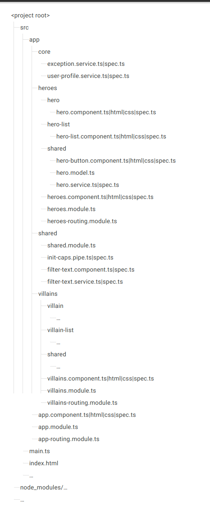

# Styleguide
<!-- For the "why?", follow https://angular.io/guide/styleguide -->

## Files
- Do define **one** thing, such as a service or component, per file.
- Max 400 lines of code/file.

## Functions
- no more than 75 lines

## Naming

File: 
- pattern: feature.type.ts
- append .component.ts, .directive.ts, .module.ts, .pipe.ts, or .service.ts

Class: 
- pattern: MyOwnClassComponent
- append Component, Directive, Module, Pipe, or Service

Service:
- Do suffix a service class name with Service
- A few terms are unambiguously services. They typically indicate agency by ending in "-er". Instead of LoggerService --> Logger

Component:
- pattern: admin-users
- Do use a custom prefix for a component 

Directive Selectors
- pattern: 

## Structural guidelines

Do put all of the application's code in a folder named src

'

While components in dedicated folders are widely preferred, another option for small applications is to keep components flat (not in a dedicated folder). This adds up to four files to the existing folder, but also reduces the folder nesting. Whatever you choose, be consistent.

...
